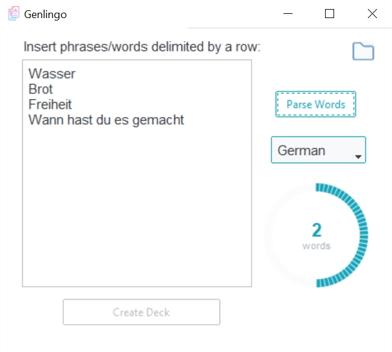

# Genlingo 



## Introduction
Genlingo is a desktop application developed in Python that allows you to effortlessly create language learning decks for Anki, a popular open-source flashcard program. By leveraging web scraping techniques, Genlingo gathers additional data from the web to enhance your language learning experience. It provides example sentences, images, and word sounds, helping you develop listening skills, stimulate imagination, and understand words in context.

## Features
- **Deck Generation**: Genlingo provides a user-friendly interface to create custom language learning decks. You can easily input your vocabulary list, specify card properties, and generate Anki-compatible decks with just a few clicks.
- **Web Scraping**: Genlingo utilizes web scraping to gather example sentences for each word, along with their human translations. This allows you to understand word usage and context more effectively.
- **Image Integration**: Genlingo automatically associates an image with each word in your flashcards. These images provide visual cues and enhance your ability to recall vocabulary accurately.
- **Word Sound Generation**: Genlingo generates word sounds for each word in your deck, allowing you to practice pronunciation and develop listening skills.
- **Efficient Anki Integration**: Exported decks from Genlingo seamlessly integrate with Anki, enabling you to import them into the Anki desktop or mobile app for immediate use. Say goodbye to manual card creation and save valuable study time.
- **Rich Media Support**: Genlingo supports the inclusion of images in your flashcards. By associating images with vocabulary, you can enhance your memorization process and reinforce visual recognition of words.

## Supported Languages

Genlingo supports various languages for language learners:
- :de: German
- :fr: French
- :gb: English
- :ru: Russian
- :es: Spanish
- :saudi_arabia: Arabic
- :israel: Hebrew

## Screenshots
 

The screenshots above demonstrate flashcards for the German language, with the target language being German and the native language being Hebrew.

## Installation
To use Genlingo, follow these steps:

1. Clone this repository to your local machine.
2. Install the required dependencies specified in [Installation Guide](install.md).
3. Launch Genlingo by executing the following command:
```bash
python genlingo.py
```
For detailed installation instructions, please refer to the [Installation Guide](install.md).

## Contributing
Contributions to Genlingo are welcome! If you would like to contribute, please follow these guidelines:
- Fork the repository and create a new branch for your feature or bug fix.
- Ensure your code adheres to the project's coding style and conventions.
- Commit your changes and submit a pull request.

## License
Genlingo is released under the [MIT License](LICENSE).

## Acknowledgments
We would like to express our gratitude to the Anki project for their exceptional flashcard software. Genlingo leverages the power of Anki to provide a seamless language learning experience.

## Contact
For any inquiries or support requests, please reach out to me at [raz3zeevy@gmail.com](mailto:raz3zeevy@gmail.com).


